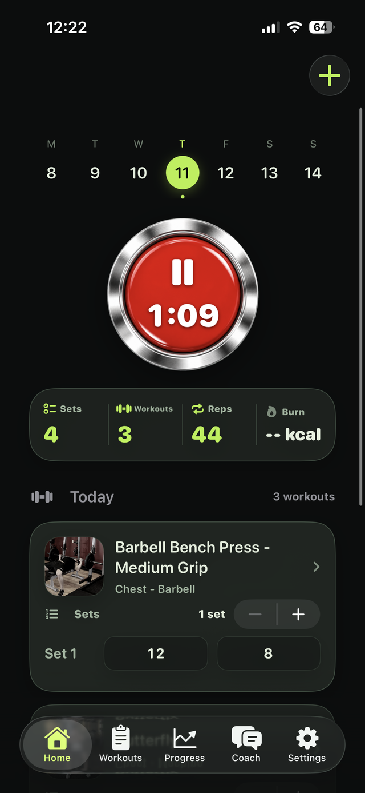
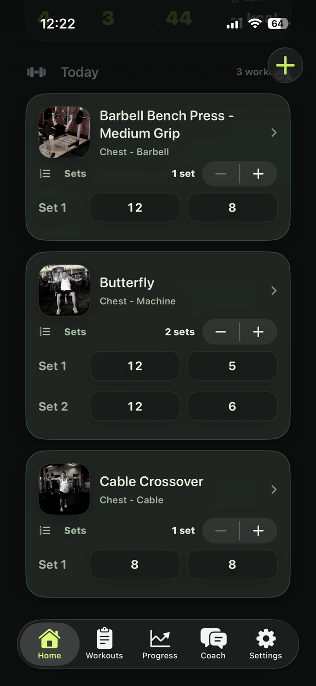
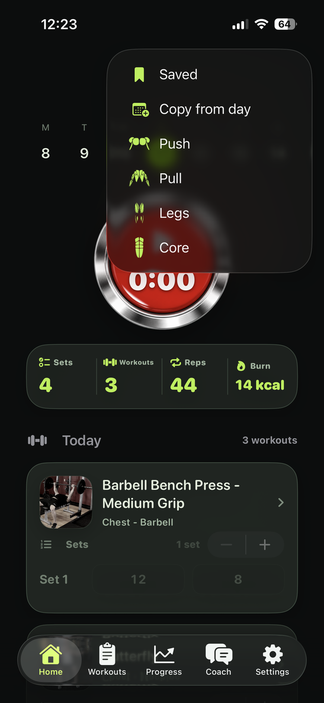
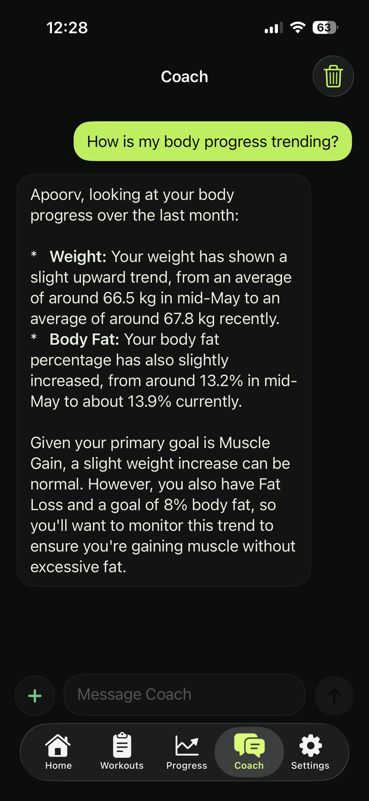
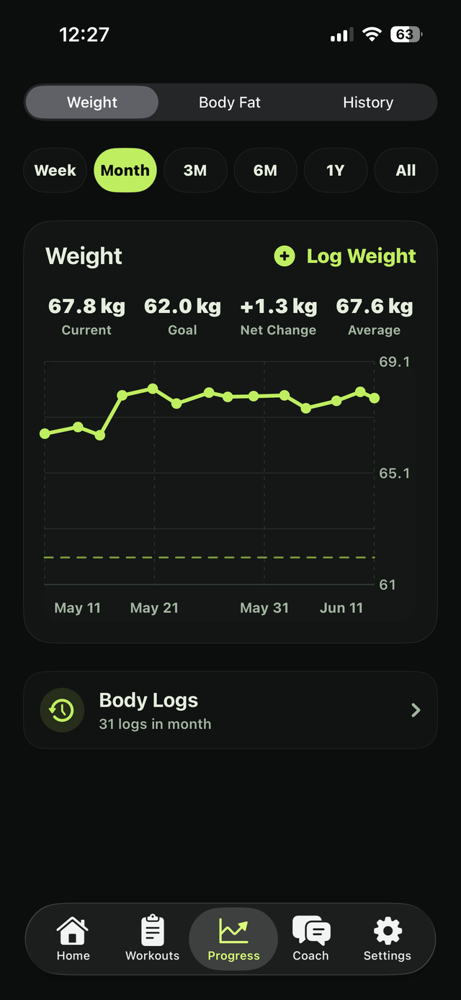
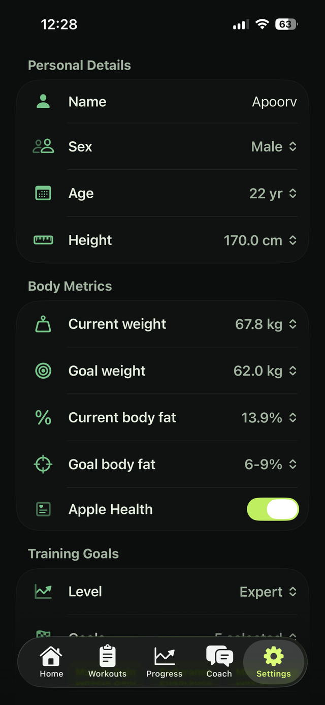

<div align="center">


# Delts

**Train with the red button.**

Plan workouts, time sessions, log sets and RPE, and track body progress — with an AI coach built in.


[](https://delts.fit)
[](https://apps.apple.com/app/id6778653288)

</div>

---

Delts is an iPhone workout planner and tracking app focused on a simple training flow: add workouts, start the red timer, log performed sets, and review body progress.

## Built By


Delts is built by **Apoorv Darshan, ACE Certified Personal Trainer** — the training flow, RPE handling, and progress tracking reflect how a coach actually programs and tracks training.

## Highlights

- Daily workout board with exercise cards, sets, reps, RPE, muscles, and equipment.
- Timer-first workout tracking with start/end session timing.
- Exercise library with target muscle, equipment, level, and split-based browsing.
- Set, rep, and RPE logging for active workouts.
- Weight and body fat progress charts with ranges, averages, net change, and goal lines.
- Optional Apple Health import/write support for weight and body fat.
- Body fat pickers with exact number and visual range modes.
- Custom theme picker with matching app icon variants.
- Settings for appearance, workout frequency, duration range, split, equipment, RPE scale, target muscles, and optional 1RM anchors.

## Screenshots

| The red button | Set logging | Exercise detail | Library |
|:---:|:---:|:---:|:---:|
|  |  |  |  |
| Start, pause, and stop the session — timing drives everything | Log sets, reps, and RPE inline while the timer runs | Photos and step-by-step form instructions for every move | 845 exercises with split, muscle, and equipment filters |

| Planning | AI Coach | Progress | Settings |
|:---:|:---:|:---:|:---:|
|  |  |  |  |
| Build today's plan in two taps — saved workouts, copied days, or split presets | A coach that sees your real workouts, progress, and goals | Weight and body fat charts with goal lines and history | Tuned to your body, goals, equipment, and units |

## Repository Layout

- `ios/` - SwiftUI iOS app and widget target.
- `web/` - Static marketing, privacy, and terms website.
- `scripts/` - Local support scripts.
- `ASSET_CREDITS.md` - Asset attribution notes.

## Run the Website

```sh
cd web
python3 -m http.server 3000
```

Then open `http://localhost:3000`.

## Build the iOS App

Open `ios/delts.xcodeproj` in Xcode and run the `delts` scheme on an iPhone target.

Command-line example:

```sh
xcodebuild -project ios/delts.xcodeproj -scheme delts -configuration Debug -destination 'generic/platform=iOS' build
```

## Contact

For support or project questions:

- apoorvdarshan@gmail.com
- ad13dtu@gmail.com

## License

This project is licensed under the terms in `LICENSE`.

