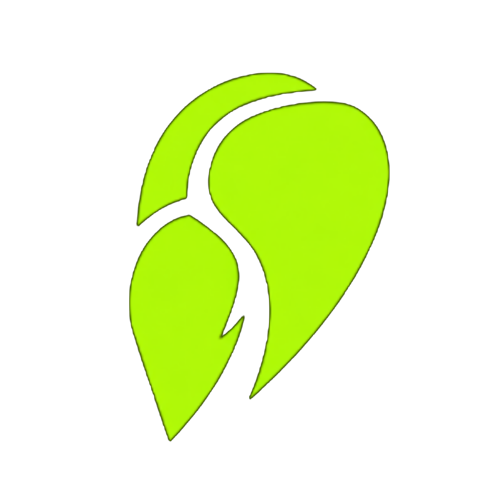
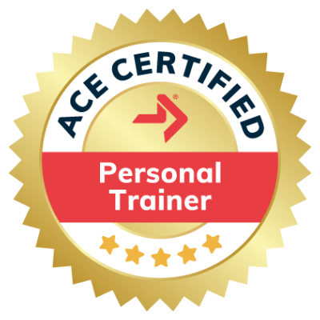
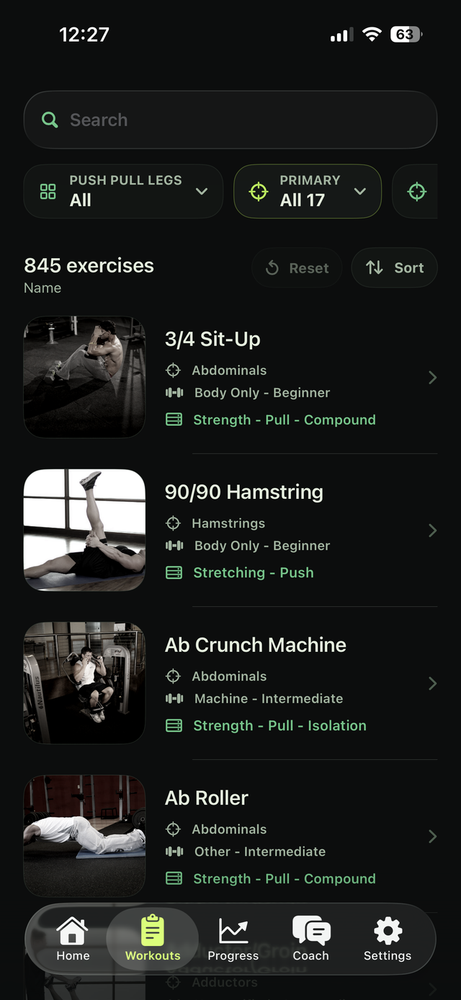
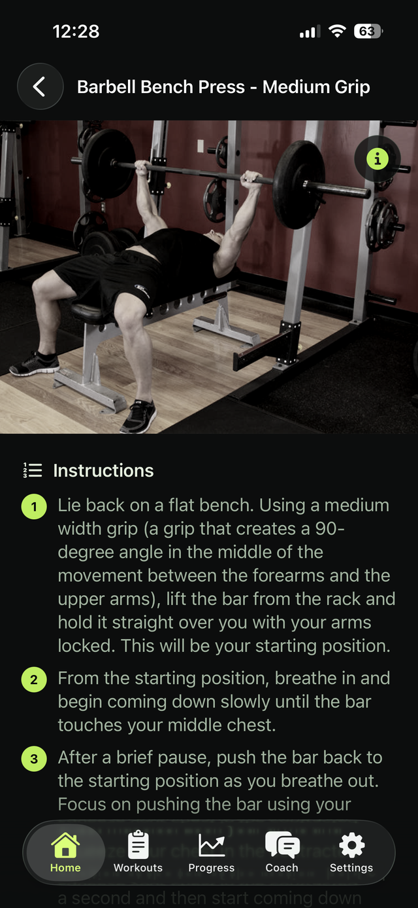

<div align="center">



# Delts

**A free exercise library for iPhone.**

Browse hundreds of exercises with clear form instructions, visuals, and powerful filters — completely free, private, and open source.


[](https://delts.fit)
[](https://apps.apple.com/app/id6778653288)
[](https://www.instagram.com/delts.fit)
[](https://www.linkedin.com/company/delts)
[](https://www.producthunt.com/products/delts)

</div>

---

Delts is a clean, fast iPhone exercise library. Search and filter a large catalog of exercises, then open any move for step-by-step instructions and visuals. No account, no ads, no tracking — everything stays on your device.

## Built By



Delts is built by **Apoorv Darshan, ACE Certified Personal Trainer**.

## Highlights

- **Hundreds of exercises** with names, target muscles, equipment, level, and category.
- **Step-by-step form instructions** and visuals for every move.
- **Powerful filters** — primary muscle, secondary muscle, equipment, level, force, mechanic, and category — plus search and sort.
- **Three simple tabs** — Workouts (the library), Settings, and About.
- **Custom theme picker** with matching app-icon variants, plus light/dark/system appearance.
- **Completely free** — no ads, no accounts, no subscriptions, no tracking. All settings stay on-device.
- **Localized** into 16 languages.
- **Open source**, built with SwiftUI.

## Screenshots

| Library | Exercise detail |
|:---:|:---:|
|  |  |
| Search and filter the full exercise catalog | Photos and step-by-step form instructions for every move |

## Repository Layout

- `ios/` — SwiftUI iOS app.
- `web/` — Static marketing, privacy, and terms website.
- `ASSET_CREDITS.md` — Asset attribution notes.

## Run the Website

```sh
cd web
python3 -m http.server 3000
```

Then open `http://localhost:3000`.

## Build the iOS App

Open `ios/delts.xcodeproj` in Xcode and run the `delts` scheme on an iPhone target.

Command-line example:

```sh
xcodebuild -project ios/delts.xcodeproj -scheme delts -configuration Debug -destination 'generic/platform=iOS' build
```

## Contact

For support or project questions:

- apoorvdarshan@gmail.com
- ad13dtu@gmail.com

Follow Delts:

- Instagram: [@delts.fit](https://www.instagram.com/delts.fit)
- LinkedIn: [Delts](https://www.linkedin.com/company/delts)
- Product Hunt: [Delts](https://www.producthunt.com/products/delts)

## License

This project is licensed under the terms in `LICENSE`.
